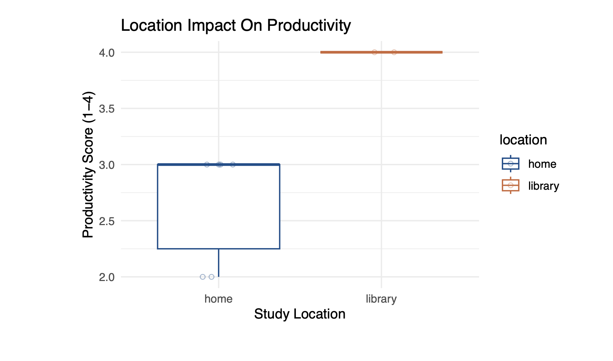
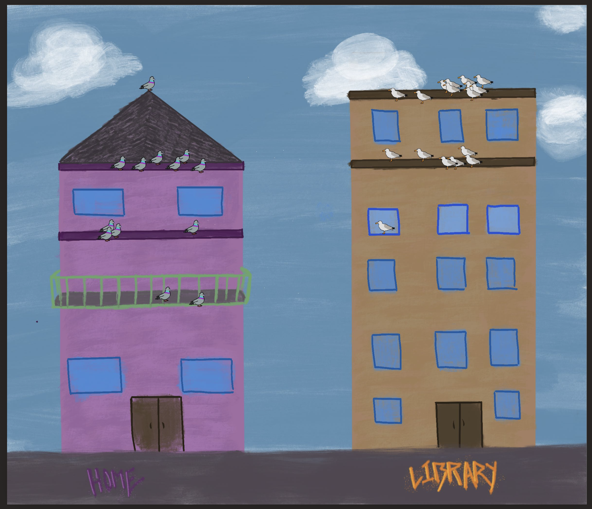

# Set Up

```{r}
#| label: packages-data
#| message: false
#| warning: false
# reading in packages
library(tidyverse)
library(janitor)
library(DHARMa)
library(here)
library(MuMIn)
library(ggeffects)
library(knitr)
# reading in nest data 
nest <- read.csv(here("data/nest_data_final.csv"))
# reading in my personal data
my_data <- read.csv(here("data/personal_data.csv")) 
```

# Problem 1. Research writing

## a. Transparent statistical methods

In part one my co-workers are using a generalized linear model test. This is seen through the response variable, whether the American Avocet utilized the habitat (San Francisco Bay), being binary data (yes or no). Additionally the binary response variable is being linked to a continuous variable, the distance from the water edge, further signalling the use of a generalized linear model.

In part two my co-workers are using a chi-squared test. This is seen through the analysis testing whether there is a relationship between two categorical variables: bird species and habitat.

## b. Suggestions for rewriting

-   **Part 1:** The data indicates that the distance to the water's edge significantly influences whether American Avocets utilizes a particular microhabitat. This means an avocet's likelihood of occupying an area changes predictably depending on how close or far the area is from the edge of the water.
-   **Part 2:** We found clear evidence that different shorebird species (American Avocet, Forter's Tern, Black-necked Stilt) prefer distinct types of habitats (managed pond, non-tidal marsh, salt pond, tidal marsh, or tidal mudflat) over others in the San Francisco Bay.

## c. Further analysis

-   **Additional Variable:** An additional variable that could influence American Avocet microhabitat use is water depth.
-   **Variable Type:** Water depth is a continuous variable that can be measured in centimeters (cm).
-   **Why?:** Water depth may influence habitat use because American Avovets are wading shorebirds that require shallow water to effectively find food. Due to this, analyzing water depth could compliment the distance to water edge data and provide a more comprehensive understanding to the specific ecosystem conditions that impact shorebird habitat use.

# Problem 2. Data analysis

## a. Clean and wrangle

```{r}
#| label: cleaning-data
# creating clean object 
nests_clean <- nest |>  
  # cleaning names
  clean_names() |>  
  # changing height_cm to be in meters
  mutate(height_m = height_cm / 100) |> 
  # selecting for desired columns
  select(height_m, 
         case_control, 
         ant_species) |>  
  # filtering for multiple values using %in%
  filter(ant_species %in% c("AB", "RRB", "BBR")) |>  
  # full scientific names in new column
  mutate(species_name = fct_recode(as.factor(ant_species),
    "C. sjostedti" = "AB",
    "C. mimosae"   = "RRB",
    "C. nigriceps"  = "BBR"
  )) |>  
  # reordering columns in desired order
  mutate(species_name = fct_relevel(species_name,
                                    "C. sjostedti",
                                    "C. mimosae",
                                    "C. nigriceps")) |> 
  # arranging by species_name
  arrange(species_name)
# displaying 10 random rows  
slice_sample(nests_clean, n = 10)
```

## b. Response variable

The 1s and 0s in this dataset, specifically seen in the case_control column, signal whether a whistling thorn tree has a bird nest. A 1 represents the presenece of a bird nest, therefore signalling the tree as 'used', and a 0 represents the absence of a bird nest, therefore signalling the tree as 'available'.

## c. Purpose of study

**Tree Height (m):** Tree height is a continuous variable measured in meters (m). As tree height increases the probability of nest occurrence would increases likely due to increased protection from predators (being higher off the ground) and structural advantages to taller trees (such as increased support). The relationship between tree height and nesting was found in the results section, paragraph one. Reasoning for why this may be helpful was inferred by me based on common biological strategies.

**Acacia Ant Species:** Acacia ant species is a categorical variable that represents distinct nonnumerical groups based on the identity of the ant symbiont occupying the tree. As the presence of aggressive ant species (C. mimosae or C. nigriceps) increases, the probability of nest occurrence would increase because these specific ants defend the host trees against predators without attacking the birds or their nestlings. Conversely, trees occupied by less aggressive ants (C. sjostedti or T. penzigi) or no ants at all would see a decrease in the probability of nest occurrence because they offer minimal protection from nest predation. I found this information from the results section in paragraph 3 and the discussion section in paragraph 1.

## d. Table of models

| Model Number | Predictors Present | Interaction Term? | Description |
|:-----------------|:-----------------|:-----------------|:-----------------|
| **Model 1** | Tree height, Ant species | No | Examines the independent main effects of tree height and ant species on the probability of nest occurrence. |
| **Model 2** | Tree height, Ant species | Yes | Examines whether the effect of tree height on the probability of nest occurrence depends on the specific ant species present. |

## e. Run the models

```{r}
#| label: run-model
#| include: false
# model 1: no interaction
model1 <- glm(
  case_control ~ height_m + species_name, 
  data = nests_clean, 
  family = binomial
)
# model 2: interaction
model2 <- glm(
  case_control ~ height_m * species_name, 
  data = nests_clean, 
  family = binomial
)
```

## f. Select the best model

```{r}
# calculating AIC from models
AICc(
  model1, 
  model2
) |> 
  # rearranged to lowest to highest values
  arrange(AICc)
```

The best model as determined by Akaike’s Information Criterion (AIC) included the effects of tree height and acacia ant species, as well as the interaction between the two, to predict the probability of nest occurrence.

## g. Check the diagnostics

```{r}
#| fig-width: 10
#| fig-height: 4
#| fig-dpi: 300
#| out-width: "100%"
# checking diagnostics with DHARMa package
simulated_res <- simulateResiduals(fittedModel = model2)
# plot the DHARMa diagnostics
plot(simulated_res)
```

-   **QQ Plot Residuals:** Points largely follow the reference line, indicating normality of residuals.
-   **Residuals vs. Predicted:** The points appear randomly distributed without a distinct pattern, and the quantile lines are relatively flat, indicating the model fits the data.

## h. Visualize the model predictions

```{r}
#| fig-width: 10
#| fig-height: 4
#| fig-dpi: 300
#| out-width: "100%"
# defining colors 
my_ant_colors <- c(
  "C. sjostedti" = "orchid3",
  "C. mimosae"   = "palegreen4",
  "C. nigriceps" = "skyblue2"
)
# creating object, preds, to store model predictions
preds <- ggpredict(model2, terms = c("height_m", "species_name"))
# changing the preds "group" column name to "species_name"
colnames(preds)[colnames(preds) == "group"] <- "species_name"
# base layer: ggplot
ggplot(mapping = aes(x = height_m, # x-axis height
                     y = case_control)) + # y-axis probability
  # first layer: geom_jitter
  geom_jitter(data = nests_clean,
              aes(color = species_name), # coloring by species name
              height = 0.05, 
              width = 0.2, 
              shape = 21, 
              alpha = 0.4) +
  # second layer: geom_line on preds data
  geom_line(data = preds, mapping = aes(x = x,
                                        y = predicted, 
                                        color = species_name)) +
  # third layer: geom_ribbon to show 95% CI
  geom_ribbon(data = preds, mapping = aes(x = x,
                                          y = predicted, 
                                          ymin = conf.low, 
                                          ymax = conf.high, 
                                          fill = species_name), 
              alpha = 0.1, 
              color = NA) +
  # making colors match my_ant_colors
  scale_color_manual(values = my_ant_colors) +
  scale_fill_manual(values = my_ant_colors) +
  # faceting by species name
  facet_wrap(~ species_name) +
  # adding a theme
  theme_classic() +
  # removing legend
  theme(legend.position = "none") +
  # adding axes titles and a title for figure
  labs(x = "Tree Height (m)", 
       y = "Probability of Nest Occurrence",
       title = "Figure 1: Probability of nest occurence in relation to tree height and ant species")
```

## i. Write a caption for your figure

**Figure 1: Probability of nest occurrence in relation to tree height and ant species.** This plot shows the probability of nest occurrence for three bird species (gray-headed sparrow, gray-capped social weaver, superb starling) across varying tree heights (m) faceted by ant species (*C. sjostedti, C. mimosae, and C. nigriceps*). The solid lines depict mean model predictions, with the shaded ribbons around the lines showing 95% confidence intervals. The open circles represent individual observations (1 = nest present, 0 = nest absent). Colors correspond to the ant species present at the tree: *C. sjostedti* (pink), *C. mimosae* (green), and *C. nigriceps* (blue). **Data source:** Lujan, E., Nielsen, R., Short, Z., Wicks, S., Nderitu Watetu, W., Malingati Khasoha, L., Palmer, T. M., Goheen, J. R., & Alston, J. M. (2023). Data, code, and metadata for: Symbiotic acacia ants drive nesting behavior by birds in an African savanna \[Data set\]. Zenodo. https://doi.org/10.5281/zenodo.8373322

## j. Calculate model predictions

```{r}
# creating object to store 600 cm prediction 
# writing as 6m to match study units more
preds_6m <- ggpredict(model2, 
                      terms = c("height_m [6]", "species_name"))
# displaying ouput
print(preds_6m)
```

## k. Interpret your results

As shown in **Figure 1**, the probability of bird nest occurrence increases significantly with tree height for trees inhabited by the aggressive ant species *C. mimosae* and *C. nigriceps*, reaching a predicted probability of 0.74 and 1.00 respectively at a height of 6 m. In contrast, the probability remains low (0.20) for trees occupied by the less aggressive ant species, *C. sjostedti*, highlighting a clear preference for trees defended by more aggressive ant symbionts. This pattern aligns with the study’s findings that birds prioritize nesting in trees defended by aggressive ants to potentially reduce nest predation risk. Furthermore, the stronger association seen with *C. nigriceps* may be due to the species' tendency to prune apical buds, creating a denser more concealed canopy that provides birds with additional physical protection from predators.

# Problem 3. Affective and exploratory visualizations

**Homework 2 Visualization**

{width="282"}

**Affective Visualization**

{width="253"}

## a. Comparing visualization

-   The visualizations differ in the amount of data visualized and the style in which they are shown. My affective visualization displays the data in a more artistic way with the underlying box plot being shown more abstractly. This contrasts the more standard formatting of my boxplot seen in my homework two exploratory visualization.
-   Both visualizations are based on a boxplot format with productivity on the y-axis and the location shown on the x-axis.
-   Both visualizations show the library productivity median bar being higher than the home productivity median. The homework 2 boxplot is less developed as less data was taken at that point in time, where the affective visualization displays more data through the pigeons and seagulls as individual observations. The relationships seen are overall the same between the visualizations with more expanded data and a lower IQR for the library data seen in the affective visualization. This shows that my productivity levels remained similar as more data was taken.
-   During week 9 I received feedback in workshop that the concept to show my visualization made sense, was personal, and fun! My peers liked my bird concept and the colors I utilized in my data. I was given feedback to thicken my actual "bars" within the visualization. Additionally based on feedback I decided to include the home and library labels as spray paint on the sidewalk to make the visualization more clear.

## b. Designing an analysis

**My Question:** Does location impact my productivity level?

**Variables:** Location (categorical, predictor), Productivity (ordinal, response)

**Analysis:** I will run a chi-square test to analyse my research question. This analysis fits my research question in how it will allow me to compare counts between group to identify if there is a relationship between my variables. A limitation to this model is that it will treat my productivity level as a categorical group instead of ordinal and will therefore look at the frequency count of each productivity level.

## c. Check any assumptions and run your analysis

### Cleaning data

```{r}
# creating a new object for clean data
my_data_clean <- my_data |> 
  # cleaning names
  clean_names() |> 
  # selecting desired columns 
  select (location, productivity_scale)
```

### Creating Observered and Expected Contingency Tables

```{r}
#| warning: false
# creating observed table object 
observed_table <- table(my_data_clean$location, 
                        my_data_clean$productivity_scale)
# performing chi-squared test to see expected values
chi_results <- chisq.test(observed_table)
# display observed table
print("Observed:")
print(observed_table)
# display expected table
print("Expected:")
print(chi_results$expected)
```

### Checking assumptions:

-   **Independent Variables:** The observations are independent because each data point represents a discrete study session recorded on distinct dates and times. By temporally separating each observation, I ensured that the productivity score of one session did not influence the outcome of subsequent sessions.
-   **Categorical Data (frequencies)** The Chi-squared test requires data to be represented as counts (frequencies) rather than continuous values. My data meets this requirement through a contingency table where each each row and column are categories (location or productivity) and each cell is a combination of those two categories.
-   **Expected Values:** Upon generating the expected values contingency table, not all cell values were a value greater than the 5 (general rule-of-thumb value). I will still proceed to utilize the chi-square test of independence while acknowledging that the smaller sample size may impact my results.

### Running Analysis

```{r}
# creating object to calculate chi-squared test statistic 
chi_stat <- chi_results$statistic
# creating object to calculate p value
p_val <- chi_results$p.value
# displaying values 
print(chi_stat)
print(p_val)
```

**Results:**

- $x^2$ = 10.82

- $p$ = 0.01

- $df$ = 3

- $a$ = 0.05

## d. Create a visualization

```{r}
# base: ggplot
ggplot(my_data_clean,
       mapping = aes(x = location, # x-axis location
                     fill = as.factor(productivity_scale))) + # fill by productivity
  # first layer: geom_bar
  geom_bar(position = "dodge", 
           color = "black") +
  # adding custom colors
  scale_fill_manual(values = c("1" = "darkred",   
                               "2" = "sienna3",   
                               "3" = "khaki2",   
                               "4" = "olivedrab")) + 
  # custom theme 
  theme_minimal() +
  # removing legend position
  theme(legend.position = "none") +
  
  labs(title = "Figure 2: Distribution of Productivity Levels by Study Location",
       x = "Study Location",
       y = "Count of Observations")


```


## e. Write a caption

## f. Write about your results

## g. Sharing your affective visualization
